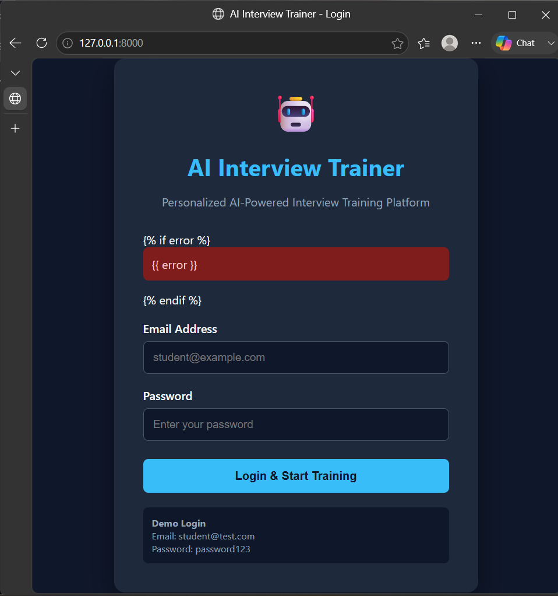

# SmartPrep AI




**SmartPrep AI** is an AI-powered interview training platform designed to help students and job seekers prepare for technical and placement interviews through structured practice, personalized preparation, and performance evaluation.

## 🚀 Features

* 🔐 User registration and login
* 👤 Personal and educational profile
* 💻 Programming and technical interview questions
* 🧠 Personalized interview preparation
* 📝 Interview test phase
* 📊 Performance tracking and results
* 🤖 Answer evaluation
* 📄 Resume analysis
* 🎯 Coding interview questions
* 🌐 Responsive web interface

## 🛠️ Technologies Used

* **Python**
* **FastAPI**
* **HTML5**
* **CSS3**
* **JavaScript**
* **SQLite**
* **JSON**
* **Git & GitHub**

## 📂 Project Structure

```text
AI_Interview_Training/
│
├── ai_interview_project/
│   ├── main.py
│   └── main_backup.py
│
├── 04 . templates/
│   ├── 1 . login.html
│   ├── 2 . personal.html
│   ├── 3 . educational.html
│   ├── 4 . skills.html
│   ├── 5 . test_phase.html
│   ├── 6 . results.html
│   └── 07 . sevices/
│       ├── __init__.py
│       ├── question_generator.py
│       ├── answer_evaluator.py
│       └── resume_analyzer.py
│
├── 05 . static/
│   ├── 01 . css/
│   │   └── 1 . css
│   └── 02 . js/
│       └── 1 . app.js
│
├── 06 . database/
│   ├── 1 . __init__.py
│   └── 2 . db.py
│
├── 08 . data/
│   ├── 1 . question.json
│   ├── 1 . question_backup.json
│   └── 2 . coding_questions.json
│
├── 09 . uploads/
│   └── .gitkeep
│
├── 10 . tests/
│   ├── 1 . __init__.py
│   └── 2 . test_app.py
│
├── requirements.txt
├── update_questions.py
├── .gitignore
└── README.md
```

## ⚙️ Installation

### 1. Clone the repository

```bash
git clone https://github.com/bhargavigurijepalli-hub/AI_Interview_Training.git
cd AI_Interview_Training
```

### 2. Create a virtual environment

```bash
python -m venv .venv
```

### 3. Activate the virtual environment

**Windows PowerShell:**

```powershell
.venv\Scripts\Activate.ps1
```

### 4. Install dependencies

```bash
pip install -r requirements.txt
```

## ▶️ Running the Application

Start the FastAPI application using:

```bash
uvicorn ai_interview_project.main:app --reload
```

The application will be available locally at:

```text
http://127.0.0.1:8000
```

## 🧪 Testing

Run the project tests using:

```bash
pytest
```

You can also check Python syntax using:

```bash
python -m py_compile ai_interview_project/main.py
```

## 🎯 Project Purpose

SmartPrep AI provides a structured platform for interview preparation. It helps users practice technical questions, complete interview tests, evaluate their answers, analyze performance, and improve their interview readiness.

## 🔮 Future Enhancements

* AI-powered real-time interview simulation
* Voice-based interview practice
* Advanced answer evaluation using NLP
* Resume-based personalized questions
* Interview performance analytics
* Additional programming languages
* Cloud deployment
* Advanced authentication and security

## 🔒 Security

The project uses environment variables and `.gitignore` configuration to help prevent sensitive files, virtual environments, compiled Python files, and local database files from being committed to the repository.

## 📌 Project Status

**Currently under active development.**

## 👩‍💻 Author

**Bhargavi Gurijepalli**

B.Tech – Computer Science and Engineering

## 🔗 Repository

[AI_Interview_Training on GitHub](https://github.com/bhargavigurijepalli-hub/AI_Interview_Training?utm_source=chatgpt.com)
